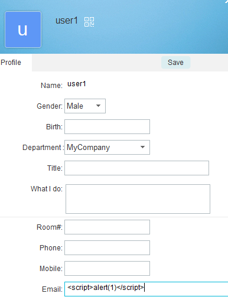
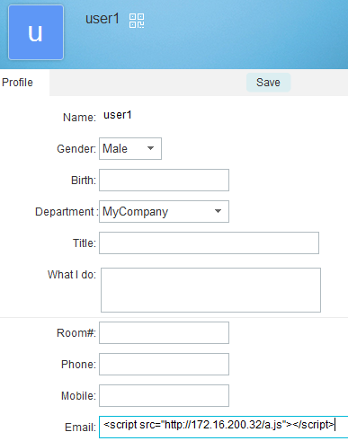

# Vulnerability
BigAnt Server Version 5.6.06 suffers from Cross Site Scripting (XSS)

# Prerequisites
Regular user account with access to BigAnt Client

# Exploit
**User can update their email address in the profile of the BigAnt Client** 

**This will cause an alert to pop on the admin console when an administrator visits** 

**Combined with CVE-2022-26281, a user can pop the administrator's PHP Session ID using ``** 
 

**This can be easily weaponized to call a javascript file to have the PHP Session ID passed back to the attacker (show in example) or create a new administrator account** 
 

# Timeline
12-01-2021: Submitted vulnerabilities to vendor via email
 12-01-2021: Vendor responded asking for more details
 12-02-2021: Responded to vendor with additional details
 12-02-2021: Vendor responded stating looking into vulnerabilities
 12-29-2021: Emailed vendor, no response
 01-11-2022: Emailed vendor, no response
 01-12-2022: Requested CVEs
 01-28-2022: CVEs assigned, no response from vendor
 02-26-2022: Emailed vendor, no response
 03-21-2022: PoC/CVE published

# Reference
[MITRE CVE-2022-23350](https://cve.mitre.org/cgi-bin/cvename.cgi?name=CVE-2022-23350)

# Disclaimer
Content is for educational and research purposes only. Author doesn’t hold any responsibility over the misuse of the software, exploits or security findings contained herein and does not condone them whatsoever.
