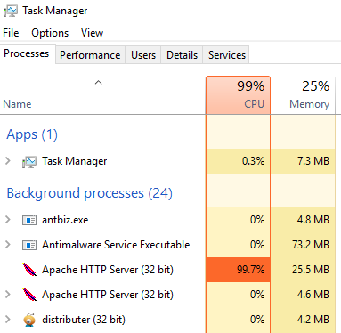
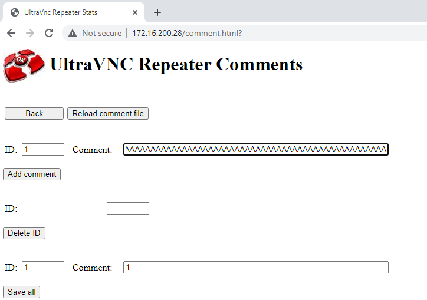
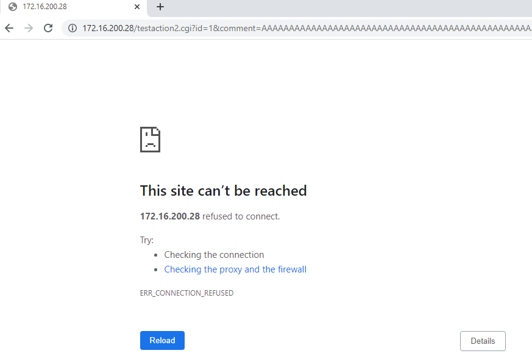
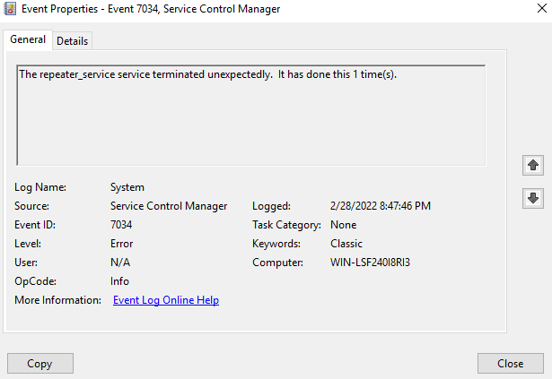

# Vulnerability
BigAnt Server Version 5.6.06 suffers from multiple Denial of Service

# Prerequisites
None

# Exploit
## Example 01: Apache Web Service
**Unauthenticated users can subtly send repeated GET requests via CURL to the following URL nd the following URL `http://<IPaddress>:8000/admin/public/download.html`, which can be scripted in a loop, to cause a CPU spike and render the web app and system to become non-response** 

**Issue resides in the following system file `C:\Program Files (x86)\BigAntSoft\IM Console\im_webserver\htdocs\Application\Admin\Common\function.php`**

## Example 02: UltraVNC Repeater Service
**When UltraVNC Repeater service is started, it runs on port 80.  No documentation states to change the default password, however this can be found at the following path on any default installation to login `C:\Program Files (x86)\BigAntSoft\IM Console\im_server\server\settings2.txt`** 

**By entering a long string into the Comment field, it will cause the repeater windows service to crash** 
 
 

# Timeline
12-01-2021: Submitted vulnerabilities to vendor via email
 12-01-2021: Vendor responded asking for more details
 12-02-2021: Responded to vendor with additional details
 12-02-2021: Vendor responded stating looking into vulnerabilities
 12-29-2021: Emailed vendor, no response
 01-11-2022: Emailed vendor, no response
 01-12-2022: Requested CVEs
 01-28-2022: CVEs assigned, no response from vendor
 02-26-2022: Emailed vendor, no response
 03-21-2022: PoC/CVE published

# Reference
[MITRE CVE-2022-23352](https://cve.mitre.org/cgi-bin/cvename.cgi?name=CVE-2022-23352)

# Disclaimer
Content is for educational and research purposes only. Author doesn’t hold any responsibility over the misuse of the software, exploits or security findings contained herein and does not condone them whatsoever.
